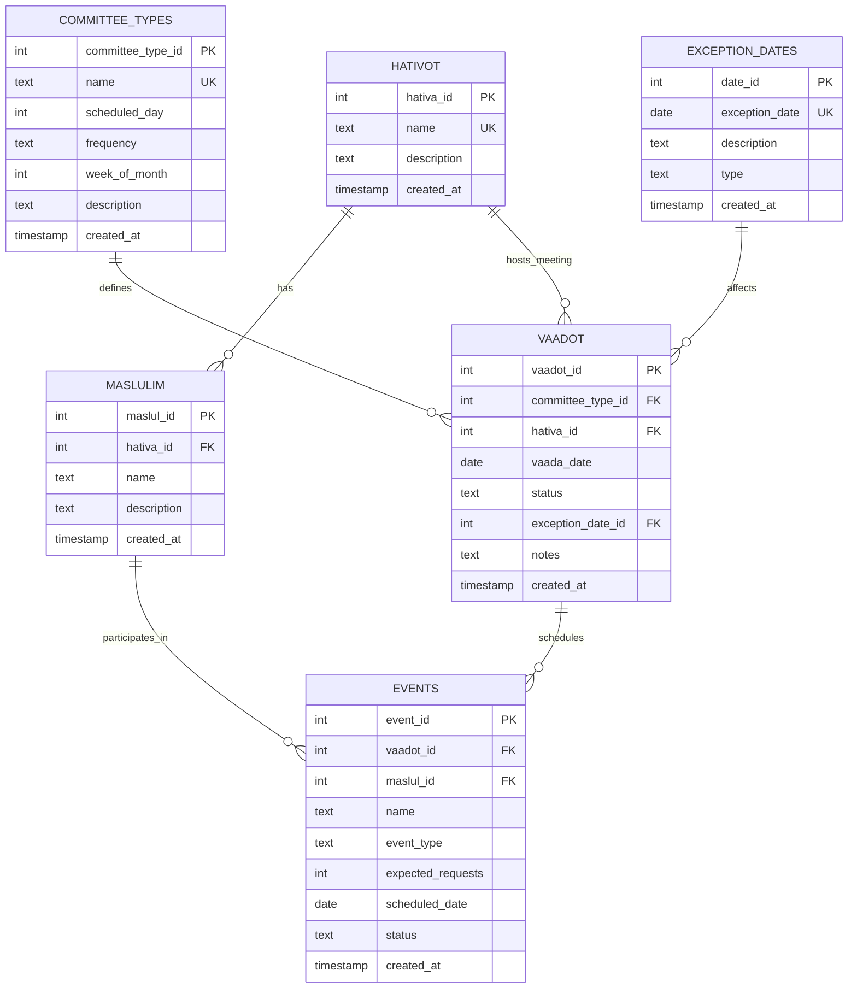

# Entity Relationship Diagram (ERD)

## Committee System Database

This ERD represents the database structure for the committee system that manages divisions (hativot), routes (maslulim), committees (vaadot), events, and exception dates.

## Table Descriptions

### HATIVOT (Divisions)
- **Purpose**: Represents organizational divisions
- **Key Fields**:
  - `hativa_id`: Primary key, auto-increment
  - `name`: Unique division name
  - `description`: Optional description
  - `created_at`: Timestamp of creation

### MASLULIM (Routes)
- **Purpose**: Represents routes within divisions
- **Key Fields**:
  - `maslul_id`: Primary key, auto-increment
  - `hativa_id`: Foreign key to HATIVOT
  - `name`: Route name
  - `description`: Optional description
  - `created_at`: Timestamp of creation

### COMMITTEE_TYPES (Committee Definitions)
- **Purpose**: Defines general committee types and their scheduling rules
- **Key Fields**:
  - `committee_type_id`: Primary key, auto-increment
  - `name`: Unique committee type name
  - `scheduled_day`: Day of week (0=Monday, 1=Tuesday, etc.)
  - `frequency`: Meeting frequency ('weekly', 'monthly')
  - `week_of_month`: For monthly committees (1-4)
  - `description`: Committee description
  - `created_at`: Timestamp of creation

### VAADOT (Committee Meeting Instances)
- **Purpose**: Represents specific committee meetings (date + division)
- **Key Fields**:
  - `vaadot_id`: Primary key, auto-increment
  - `committee_type_id`: Foreign key to COMMITTEE_TYPES (required)
  - `hativa_id`: Foreign key to HATIVOT (required)
  - `vaada_date`: Actual date of the committee meeting (required)
  - `status`: Meeting status ('planned', 'scheduled', 'completed', 'cancelled')
  - `exception_date_id`: Optional foreign key to EXCEPTION_DATES
  - `notes`: Optional meeting notes
  - `created_at`: Timestamp of creation

### EVENTS
- **Purpose**: Represents scheduled events for committees and routes
- **Key Fields**:
  - `event_id`: Primary key, auto-increment
  - `vaadot_id`: Foreign key to VAADOT (required)
  - `maslul_id`: Foreign key to MASLULIM (required)
  - `name`: Event name
  - `event_type`: Type of event ('kokok' or 'shotef')
  - `expected_requests`: Number of expected requests
  - `scheduled_date`: Date when event is scheduled
  - `status`: Event status ('planned', 'scheduled', 'completed', 'cancelled')
  - `created_at`: Timestamp of creation

### EXCEPTION_DATES
- **Purpose**: Stores dates when committees should not meet
- **Key Fields**:
  - `date_id`: Primary key, auto-increment
  - `exception_date`: Unique date that is an exception
  - `description`: Description of the exception
  - `type`: Type of exception ('holiday', 'sabbath', 'special')
  - `created_at`: Timestamp of creation

## Relationships

1. **HATIVOT → MASLULIM** (One-to-Many)
   - Each division can have multiple routes
   - Each route belongs to exactly one division

2. **COMMITTEE_TYPES → VAADOT** (One-to-Many)
   - Each committee type can have multiple meeting instances
   - Each meeting belongs to exactly one committee type

3. **HATIVOT → VAADOT** (One-to-Many)
   - Each division can host multiple committee meetings
   - Each meeting belongs to exactly one division

4. **VAADOT → EVENTS** (One-to-Many)
   - Each committee meeting can schedule multiple events
   - Each event belongs to exactly one committee meeting

5. **MASLULIM → EVENTS** (One-to-Many)
   - Each route can participate in multiple events
   - Each event involves exactly one route

6. **VAADOT → EXCEPTION_DATES** (Many-to-One, Optional)
   - Committee meetings can be linked to exception dates when affected
   - Exception dates can affect multiple committee meetings

6. **EXCEPTION_DATES** (Referenced by VAADOT)
   - Table for managing non-working dates
   - Can be referenced by committees when meetings are affected by exceptions

## Default Data

The system includes default committees:
- **ועדת הזנק** (Monday, Weekly)
- **ועדת תשתיות** (Wednesday, Weekly)
- **ועדת צמיחה** (Thursday, Weekly)
- **ייצור מתקדם** (Tuesday, Monthly - 3rd week)

## Business Rules

1. Committee names must be unique
2. Division names must be unique
3. Exception dates must be unique
4. Events must be associated with both a committee and a route
5. Monthly committees specify which week of the month they meet
6. Event types are restricted to 'kokok' or 'shotef'
7. Event status follows the lifecycle: planned → scheduled → completed/cancelled
